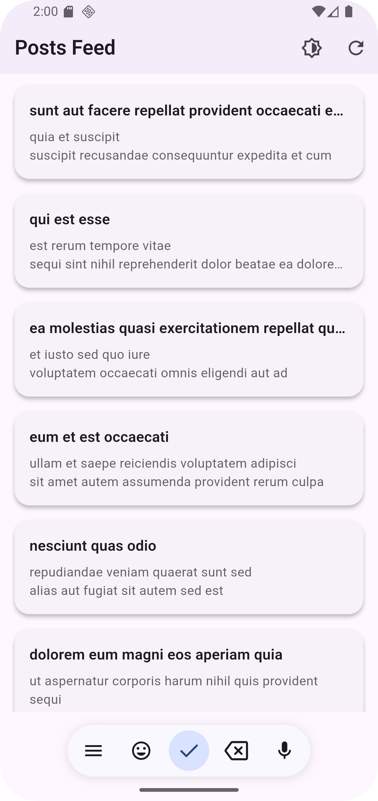
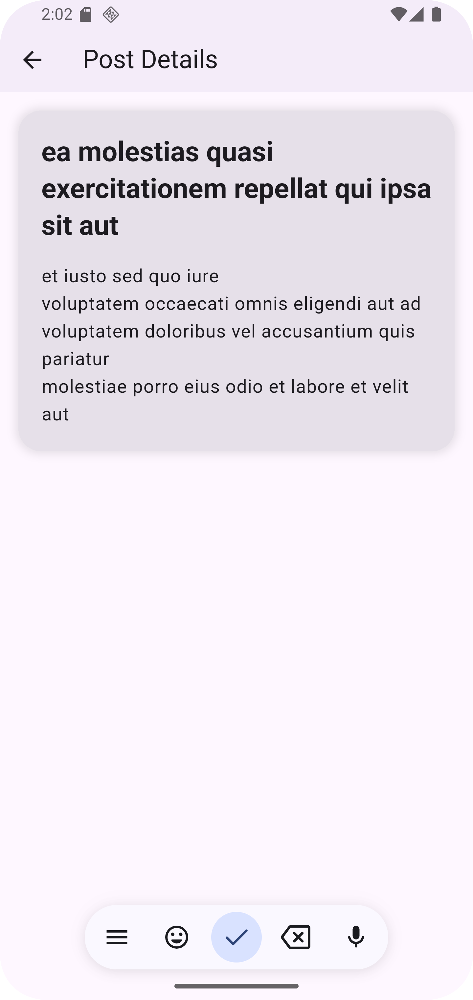

#  Flutter Take Home Assignment

A simple Flutter app that displays a list of posts and their details using the free API from [JSONPlaceholder](https://jsonplaceholder.typicode.com/).  
The project follows the **MVVM architecture**, uses **Dio** for networking, **GetX** for state management, and **GetStorage** for local caching and theme persistence.

##  Features

- Fetch list of posts from API (`/posts`)
- View post details (`/posts/{id}`)
- Loading, error, and cached states
- MVVM architecture with GetX
- Dark and Light mode support
- Clean UI with Material 3 design

##  Libraries Used & Why

| Library | Purpose | Why Used |

| **dio** | REST API calls | Advanced HTTP client with interceptors, timeout, and response handling |
| **get** | State management & navigation | Lightweight, reactive, and perfect for MVVM pattern |
| **get_storage** | Local caching | Simple, fast key-value storage to cache API responses and theme mode |
| **flutter/material.dart** | UI framework | Core Flutter Material components |
| **google_fonts** *(optional)* | Custom typography | For clean, modern font styling |
| **cached_network_image** *(optional)* | Image caching | To handle network images efficiently (if needed) |

##  Screenshots

 Posts List Screen   
|  |
 Post Detail Screen 
 |

##  Project Structure

lib/
├─ data/
│ ├─ models/ → Data models (Post)
│ ├─ network/ → Dio client setup
│ └─ repository/ → API and caching logic
├─ viewmodel/ → GetX controllers (MVVM)
├─ ui/
│ ├─ screens/ → PostListScreen, PostDetailScreen
│ └─ widgets/ → Reusable UI components
├─ utils/ → Themes, constants
└─ main.dart → App entry point
